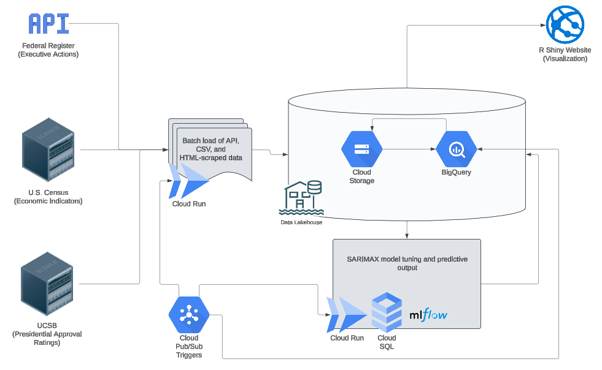

# Can Presidential 'Executive Order' Volume Be Predicted?

Building a pipeline and predictive model of executive order counts based on economic and political indicators.

## Overview

This is mostly a data engineering project: scraping data sources from a RESTful API, a regularly updated public-facing bank of CSV files, and a bunch of reasonably well-organized using HTML tables. This data is then used to build a SARIMAX model, with hyperparameter tuning performed using mlflow. All of this work was performed on the Google Cloud Platform, because it's what I use at work right now, and this gave me the opportunity to play around with a bunch of stuff before I put in a big access request to our IAM team.

What this repository is *emphatically not* is an instruction manual. I have attached a free-to-use license here, and you're welcome to go to town with it, but this is a personal project (which I used for a capstone presentation during my Master's Degree.

## Data Architecture

## Data Sources

Executive order data is retrieved from the Federal Register[^2].

Economic indicator data is retreived from the U.S. Census Bureau[^3].

Presidential job approval data is retreived from UC Santa Barbara[^4].

## Acknowledgments

This work was heavily influenced by a letter[^1] published in the American Political Science Review in 2019 and, in the future, I hope to expand my work to include the indicators and methods outlined by Drs. Dino P. Christensen and Douglas L. Kriner.

Any success implementing an mlflow server on PostGRESQL on Google Cloud Platform is a result of the outstanding work [provided here by DLabs](https://github.com/dlabsai/mlflow-for-gcp).

## References

[^2]: U.S. National Archives (n.d.). Executive Orders. Federal Register. Retrieved January 21, 2025, from https://www.federalregister.gov/presidential-documents/executive-orders

[^3]: U.S. Census. (2025, January 21). Census Bureau Economic Briefing Room. Retrieved January 21, 2025, from  https://www.census.gov/economic-indicators/

[^4]: University of California Santa Barbara (2024, September 23). Presidential Job Approval--All Data. The American Presidency Project. Retrieved January 21, 2025, from https://www.presidency.ucsb.edu/statistics/data/presidential-job-approval-all-data

[^1]: CHRISTENSON, D. P., & KRINER, D. L. (2019). *Does Public Opinion Constrain Presidential Unilateralism?* American Political Science Review, 113(4), 1071–1077. doi:10.1017/S0003055419000327
